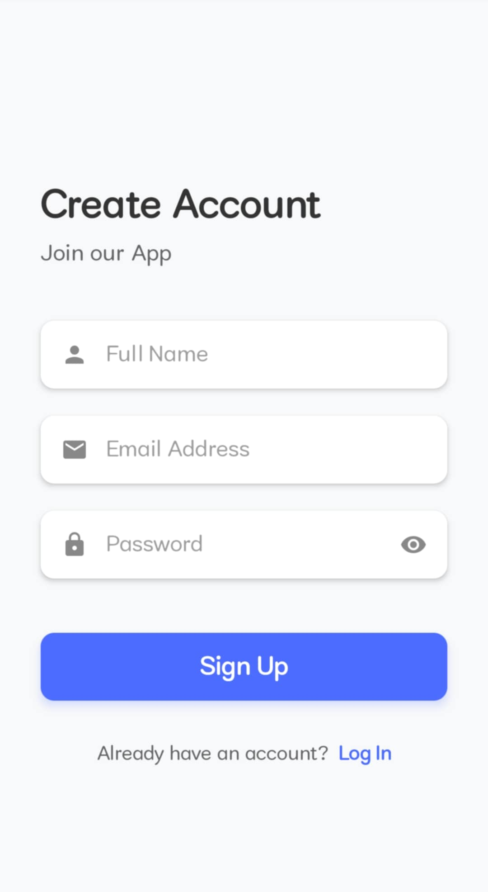
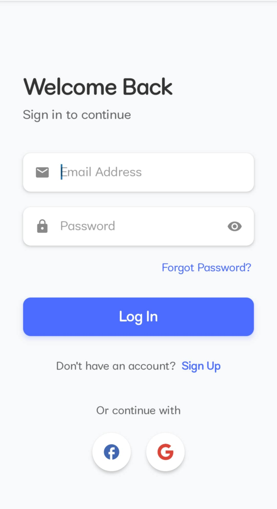
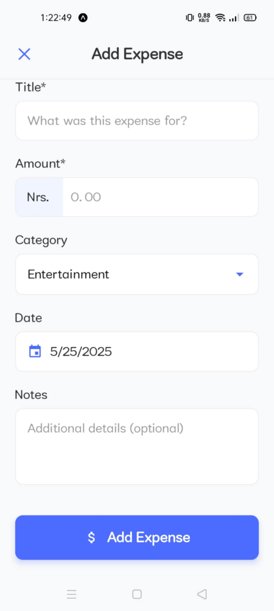

# Expense_Tracker

Expense Tracker
A React Native mobile application for tracking personal expenses, visualizing spending patterns, and managing user profiles. The app supports manual and social logins (Facebook, Google), displays expenses in interactive charts, and features a modern UI with a personalized user avatar.
Features

User Authentication: Secure login via email/password, Facebook, or Google.
Expense Tracking: Add, view, and categorize expenses with details like amount, date, and category.
Spending Visualization: Line and pie charts to display weekly and category-based spending.
User Profile: Displays user’s name, email, and a circular avatar with the first letter of their name.
Responsive Design: Modern UI with a consistent color scheme (#4a6bff accents, #f8f9fa background).
Pull-to-Refresh: Refresh expenses and user data seamlessly.
Floating Action Button: Quick access to add new expenses.

Technologies Used

React Native: For cross-platform mobile development (iOS and Android).
React Navigation: For screen navigation and routing.
Axios: For API requests to the backend.
AsyncStorage: For storing authentication tokens locally.
react-native-chart-kit: For rendering line and pie charts.
Expo Vector Icons: For MaterialIcons, AntDesign, and Feather icons.
Backend: Assumed REST API (e.g., Node.js, Express) for user and expense data.

Prerequisites

Node.js (v16 or higher)
npm or Yarn
React Native CLI or Expo CLI
Android Studio or Xcode for emulators
Backend server with endpoints for authentication, user profile, expenses, and categories

Setup Instructions

Clone the Repository:
git clone https://github.com/Grishj/Expense_Tracker.git
cd Expense_Tracker

Install Dependencies:
npm install

or
yarn install

Set Up Environment:

Ensure you have a backend server running with the following endpoints:
POST /auth/login: Authenticate email/password and return JWT token.
POST /auth/facebook: Authenticate via Facebook and return JWT token.
POST /auth/google: Authenticate via Google and return JWT token.
GET /api/profile: Return user details (name, email).
GET /categories: Return expense categories (id, name, icon, color).
GET /expenses: Return user expenses (id, title, amount, date, categoryId).

Update utils/api.js with your backend’s base URL:import axios from "axios";

const backend = axios.create({
baseURL: "YOUR_BACKEND_URL", // e.g., http://localhost:3000
});

export default backend;

Run the App:

For React Native CLI:npx react-native run-android

ornpx react-native run-ios

For Expo:expo start

Social Login Setup (Optional):

Configure Facebook and Google OAuth credentials.
Integrate with Firebase Auth or Expo’s AuthSession for social login.
Update LoginScreen.js’s handleSocialLogin to handle OAuth tokens.

Project Structure
Expense_Tracker/
├── src/
│ ├── screens/
│ │ ├── HomeScreen.js # Main screen with expense overview and charts
│ │ ├── ProfileScreen.js # User profile with avatar and menu
│ │ ├── LoginScreen.js # Login with email/password and social options
│ ├── utils/
│ │ ├── api.js # Axios instance for API calls
│ │ ├── auth.js # AsyncStorage utilities for token management
├── README.md
├── package.json

Screenshots

### Screenshot 1: SignUp Screen

### Screenshot 2: SignIn Screen

### Screenshot 3: Home Screen

### Screenshot 3: AddExpense Screen

Backend Requirements
The app relies on a REST API with the following endpoints:

POST /auth/login: { email, password } → { token }
POST /auth/facebook: { accessToken } → { token }
POST /auth/google: { accessToken } → { token }
GET /api/profile: Returns { name, email }
GET /categories: Returns [{ id, name, icon, color }, ...]
GET /expenses: Returns [{ id, title, amount, date, categoryId }, ...]

Ensure the backend stores the user’s name consistently, whether from social login (Facebook, Google) or manual signup.
Contributing

Fork the repository.
Create a feature branch (git checkout -b feature/your-feature).
Commit changes (git commit -m "Add your feature").
Push to the branch (git push origin feature/your-feature).
Open a pull request.

License
MIT License. See LICENSE for details.
